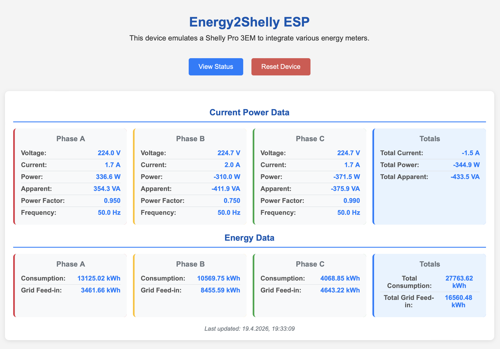

# Energy2Shelly_ESP

### Getting started
This is a Shelly Pro 3EM Emulator running on ESP8266 or ESP32 using various input sources for power data. 
This can be used for zero feed-in with Hoymiles MS-A2, Growatt NOAH/NEXA and Marstek Venus (testers needed!).

Kudos to @sdeigms excellent work at https://github.com/sdeigm/uni-meter which made this port easily possible. 
SMA Multicast code is based on https://www.mikrocontroller.net/topic/559607

# Installation
## Option 1: Compile yourself
Compile and flash for your microcontroller using [PlatformIO](https://platformio.org/)
## Option 2: Flash pre-compiled binary via browser 
Connect your ESP to your PC using USB and follow the instructions on the [webflasher](https://therealmoeder.github.io/Energy2Shelly_ESP/)

# Configuration
#### 1. Power device and wait for a hotspot named "Energy2Shelly"
#### 2. Connect to that hotspot
#### 3. Enter wifi and configuration data using the captive portal or by opening http://192.168.4.1/

  #### On the captive portal you can currently set a data source for power data. The following options are available:
  - <code>MQTT</code>
    - Server IP, port, username, password and topic
    - Power values on the MQTT topic are expected in JSON format. The are multiple fields to define available values using a JSON Path-style syntax.
      You can also select between monophase and triphase power data. 
      
      example (monophase profile):
        - Total power JSON path -> <code>ENERGY.Power</code> for <code>{"ENERGY":{"Power":9.99}}</code> 
        - Phase 1 power JSON path -> "no definition"  
        - Phase 2 power JSON path -> "no definition"  
        - Phase 3 power JSON path -> "no definition"  
        - Energy from grid JSON path -> <code>ENERGY.Consumption</code> for <code>{"ENERGY":{"Consumption":77}}</code> 
        - Energy to grid JSON path ->  <code>ENERGY.Production</code> for  <code>{"ENERGY":{"Production":33}}</code> 
              -> Energy2Shelly_ESP responds to  <code>{"ENERGY":{"Power": 9.99,"Consumption":77,"Production":33}}</code> 

      example (triphase profile):
        - Total power JSON path -> <code>ENERGY.Power</code> for <code>{"ENERGY":{"Power":7.3}}</code> 
        - Phase 1 power JSON path -> <code>ENERGY.Pow1</code> for <code>{"ENERGY":{"Pow1":98}}</code> 
        - Phase 2 power JSON path -> <code>ENERGY.Pow2</code> for <code>{"ENERGY":{"Pow2":196}}</code> 
        - Phase 3 power JSON path -> <code>ENERGY.Pow3</code> for <code>{"ENERGY":{"Pow3":294}}</code> 
        - Energy from grid JSON path -> <code>ENERGY.Consumption</code> for <code>{"ENERGY":{"Consumption":98}}</code>
        - Energy to grid JSON path ->  <code>ENERGY.Production</code> for  <code>{"ENERGY":{"Production":131}}</code> 
              -> Energy2Shelly_ESP responds to  <code>{"ENERGY":{"Power":7.3,"Pow1":98,"Pow2":196,"Pow3":294,"Consumption":98,"Production":131}}</code> 
        
  - <code>SMA</code>
    - SMA Energy Meter or Home Manager UDP multicast data
    - if you have multiple SMA energy meters you can optionally provide the serial number of the source you want to use in the configuration options
  - <code>SHRDZM</code>
    - SHRDZM smart meter interface (common in Austria) with UDP unicast data
    - please enable UDP broadcasts to the IP of the ESP and port 9522 within SHRDZM
  - <code>HTTP</code>
    - a generic HTTP input
    - enter a query URL in the second parameter field which delivers JSON data and define at least the JSON Path for total power.
    - for full details on JSONPath configuration, check the section on MQTT above. 
  - <code>SUNSPEC</code>
    - generic SUNSPEC register data polling via Modbus TCP
    - you can setup host ip of Modbus device (e.g. Kostal Smart energy meter)
    - Modbus TCP port (usually 502)
    - Modbus Device ID of the unit ID (71 for KSEM)
  - <code>TIBBERPULSE</code>
    - Parses SML data from your Tibber Pulse IR locally using the [sml_parser](https://github.com/olliiiver/sml_parser) ESP library. This is a great option if you want to use Tibber Pulse data for zero feed-in with Hoymiles MS-A2, Growatt NOAH/NEXA, or Marstek Venus inverters/batteries.
    - Follow [these](https://github.com/marq24/ha-tibber-pulse-local#tibber-pulse-ir-local) instructions to access your Tibber Pulse/Bridge data locally.
    - Provide the `IP address / hostname` and `port` of the WebSocket API, plus `username` and `password` of your Tibber Bridge, in the configuration options so Energy2Shelly_ESP can connect and receive power data.
    - The parser automatically extracts `total power`, `phase power` and `energy from/to the grid` from the WebSocket API data stream and makes it available for the Shelly Pro 3EM Emulator.
    - Following power meters are currently supported and implemented in the parser:
      - **EMH EHZB** (SML message length: 248)
      - **eBZ DD3** (SML message length: 396)
    - Support for additional power meters can be easily added. If you can provide your meter's SML sample data and message length and confirm that the parser works with your meter's data stream, then please open an issue or, even better, a PR with the details!

  #### Here are some sample generic HTTP query paths for common devices:
  - Fronius: <code>http://IP-address/solar_api/v1/GetMeterRealtimeData.cgi?Scope=System</code>
  - Tasmota devices: <code>http://IP-address/cm?cmnd=status%2010</code>
  - ioBroker datapoints: <code>http://IP-address:8082/getBulk/smartmeter.0.1-0:1_8_0__255.value,smartmeter.0.1-0:2_8_0__255.value,smartmeter.0.1-0:16_7_0__255.value/?json</code>
  
  The Shelly ID defaults to the ESP's MAC address, you may change this if you want to substitute an existing uni-meter configuration without reconnecting the battery to a new shelly device.
  
  #### How the <code>phase_number</code> option can be used:
  - If you have a monophase setup, set <code>phase_number</code> to <code>1</code>. This asigns all power and energy data to phase 1.
  - If you have a triphase setup, set <code>phase_number</code> to <code>3</code>. This distributes power and energy data across all three phases.
  
  > [!NOTE]
  > This option controls how energy2shelly firmware outputs energy data, it does not change the input data. So if you have a triphase setup but want to assign all data to phase 1, set <code>phase_number</code> to <code>1</code>. The TRIPAHSE option in JSONPATH settings only controls how the firmware reads the input data, not how it outputs this data.
  
#### 4. Check if your device is visible in the WLAN. <code>http://IP-address</code> 
#### 5. Check the current power data at <code>http://IP-address/status</code> 
- [ ] \(Optional) If you want to reset you Wifi-Configuration and/or reconfigure other settings go to <code>http://IP-address/reset</code> and reconnect to the Energy2Shelly hotspot.

# Tested microcontrollers
* ESP32 (ESP32-WROOM-32)
* ESP8266

# You found a bug
First, sorry. This software is not perfect.
1. Open an issue
- With helpful title - use descriptive keywords in the title and body so others can find your bug (avoiding duplicates).
- Which branch, what microcontroller, what setup
- Steps to reproduce the problem, with actual vs. expected results
- If you find a bug in our code, post the files and the lines.
2. Open a PR 😻
- Explain in detail your changes
- Ask for a review

# some screenshots from project
  

  ### Settings
  
  

  ### main page <code>http://IP-address</code>
  

  ### status page <code>http://IP-address/status</code>
  

  > [!NOTE]
  > Images may vary depending on the version. We always try to be up to date.
